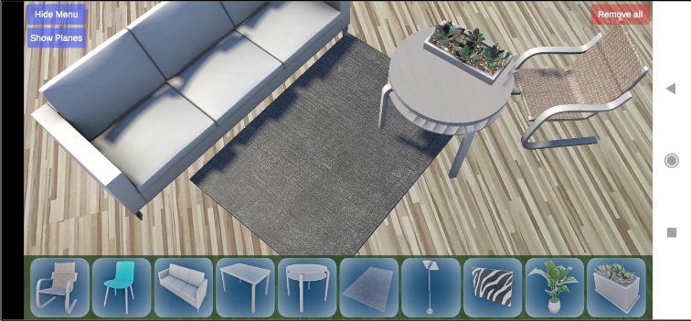

# ReAugment
ReAugment is an Augmented Reality (AR) mobile application developed in Unity using C#. It allows users to place and customize furniture in real-world environments using AR technology.  

  

  
🔧 Key Technologies:  
    Unity Packages/Plugins: ARFoundation, LeanTouch  
    Furniture Models: HDRP Furniture Pack (Credits to the original author)  

🛠 Functionality:  
    ARPlaneManager: Detects trackable planes for object placement.  
    User Interaction: Place furniture with a tap, move, resize, and rotate objects using intuitive finger gestures (LeanTouch scripts).  
    Customization: Toggle options to show/hide tracked planes and the UI for clearer visibility.  
    Reset: Remove all placed objects with a single button.  

🌐 Resources That Helped:  
    [Unity XR Manual](https://docs.unity3d.com/Manual/XR.html)  
    [Google AR Foundation](https://developers.google.com/ar/develop/unity-arf/getting-started-ar-foundation)  
    [AR Hello World](https://learn.unity.com/project/ar-hello-world)  
    [Unity ARFoundation Samples](https://github.com/Unity-Technologies/arfoundation-samples)  
    [LeanTouch Documentation](https://carloswilkes.com/Documentation/LeanTouch)  
    [Object Manipulation Tutorial](https://learn.unity.com/tutorial/manipulating-objects-in-ar-with-lean-touch?uv=2019.4#)  
